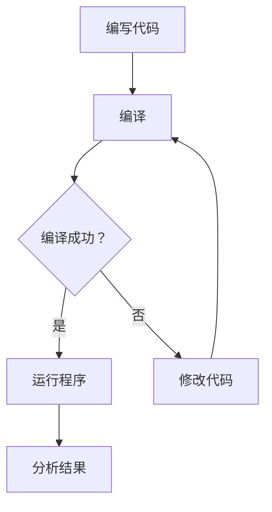
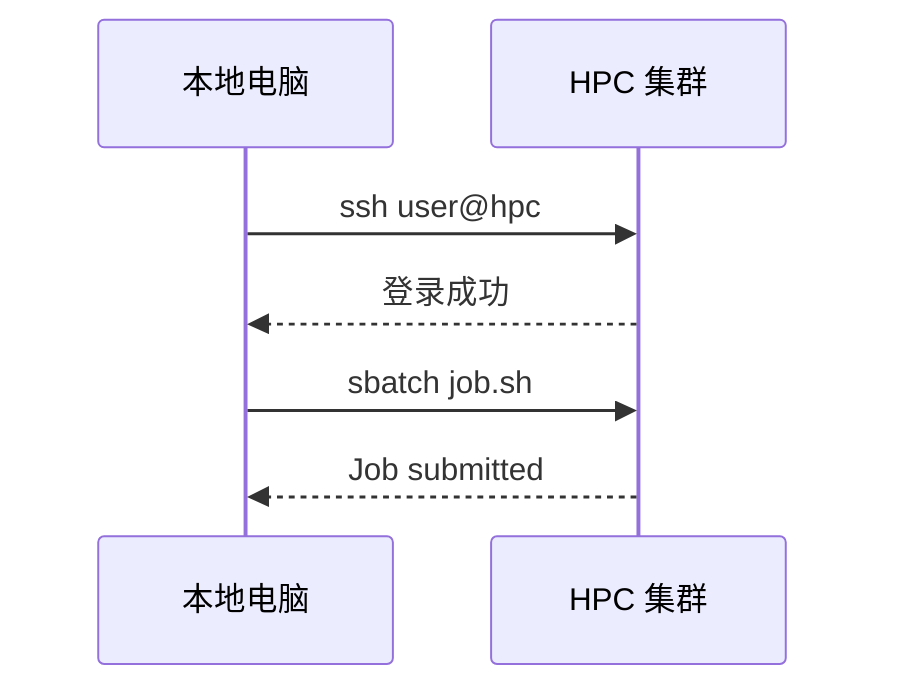

# 第 9 章：文档写作：Markdown、Mermaid 与 LaTeX

**Writing with Markdown, Mermaid, and LaTeX**

---

## 本章目标

读完本章后，你应该能够：

- 用 Markdown 写结构清晰的文档、笔记和 README
- 用 Mermaid 在 Markdown 中画流程图
- 理解 LaTeX 的基本思想，编写数学公式
- 写出一个最小 LaTeX 文档和 Beamer 幻灯片
- 明确 Markdown 与 LaTeX 各自的适用场景

---

## 动机

科研不只是写代码和跑程序。你需要写**笔记、报告、论文、作业、幻灯片**。Word 在科研写作中有明显局限：公式排版差、版本管理困难、格式不稳定。

纯文本写作工具（Markdown 和 LaTeX）解决了这些问题：它们是**纯文本文件**，可以用 Git 管理版本，公式排版精美，格式与内容分离。

---

## 9.1 为什么科研中要会纯文本写作

| 维度 | Word / Google Docs | Markdown | LaTeX |
|------|-------------------|----------|-------|
| 公式 | 较弱 | 支持（KaTeX/MathJax） | 极强 |
| 版本控制 | 困难 | Git 友好 | Git 友好 |
| 输出格式 | .docx | HTML / PDF / slides | PDF |
| 学习曲线 | 低 | 低 | 中-高 |
| 适合场景 | 日常文档 | 笔记、文档、博客 | 论文、报告、幻灯片 |

:::tip 选择原则
- **快速记录、团队协作、笔记** → Markdown
- **正式论文、需要精确排版** → LaTeX
- **两者都不会？** 先学 Markdown，10 分钟就能上手
:::

---

## 9.2 Markdown 基础语法

Markdown 用简单的符号标记文本格式，源文件是纯文本（`.md`），可以渲染为 HTML、PDF 等。

```markdown
# 一级标题
## 二级标题
### 三级标题

**粗体**  *斜体*  ~~删除线~~  `行内代码`

- 无序列表项
  - 嵌套项

1. 有序列表项
2. 有序列表项

> 引用文字

---   ← 分隔线
```

---

## 9.3 表格、代码块、图片、链接

```markdown
| 方法 | 精度 | 速度 |
|------|------|------|
| Euler | O(h) | 快 |
| RK4 | O(h⁴) | 中 |
```

代码块用三个反引号包裹，并标注语言：

````markdown
```python
import numpy as np
x = np.linspace(0, 2*np.pi, 100)
y = np.sin(x)
```
````

图片与链接：

```markdown

[链接文字](https://example.com)
```

---

## 9.4 Mermaid 画流程图和结构图

Mermaid 是一种在 Markdown 中嵌入图表的语法。GitHub、Obsidian、Docusaurus 等都支持。

````markdown

````

````markdown

````

:::info Mermaid 的限制
Mermaid 适合画**示意性**的图表，不适合精确的科学绘图。数据可视化请用 Matplotlib，复杂学术图表请用 TikZ。
:::

---

## 9.5 在 VS Code 中写 Markdown

VS Code 是写 Markdown 最方便的工具之一，内置了 Markdown 预览，配合插件可以获得极好的写作体验。

### 内置功能

VS Code 原生支持 Markdown：

- 语法高亮
- 按 `Ctrl+Shift+V`（macOS: `Cmd+Shift+V`）打开预览
- 按 `Ctrl+K V`（macOS: `Cmd+K V`）打开侧边预览（边写边看）

### 推荐插件

| 插件名 | 扩展 ID | 用途 |
|-------|---------|------|
| **Markdown All in One** | `yzhang.markdown-all-in-one` | 快捷键、目录生成、自动补全、列表格式化 |
| **Markdown Preview Enhanced** | `shd101wyy.markdown-preview-enhanced` | 增强预览：支持 LaTeX 公式、Mermaid、PlantUML、导出 PDF/HTML |
| **markdownlint** | `davidanson.vscode-markdownlint` | Markdown 格式检查，保持文档规范 |
| **Paste Image** | `mushan.vscode-paste-image` | 截图后直接 `Ctrl+Alt+V` 粘贴图片到 Markdown |
| **Markdown Table Formatter** | `fcrespo82.edit-csv` | 自动对齐 Markdown 表格 |

命令行一键安装：

```bash
code --install-extension yzhang.markdown-all-in-one
code --install-extension shd101wyy.markdown-preview-enhanced
code --install-extension davidanson.vscode-markdownlint
code --install-extension mushan.vscode-paste-image
```

### Markdown All in One 常用功能

安装后可以使用以下快捷键（macOS 用 `Cmd` 替换 `Ctrl`）：

| 快捷键 | 功能 |
|-------|------|
| `Ctrl+B` | 加粗 |
| `Ctrl+I` | 斜体 |
| `Ctrl+Shift+]` | 提升标题级别 |
| `Ctrl+Shift+[` | 降低标题级别 |
| `Alt+C` | 勾选/取消勾选 checkbox |

其他功能：
- 在命令面板（`Ctrl+Shift+P`）中搜索 **"Markdown All in One: Create Table of Contents"** 可以自动生成目录
- 保存时自动更新目录
- 自动修复有序列表编号

### Markdown Preview Enhanced 的高级功能

这个插件的预览功能远强于 VS Code 内置预览：

- 支持 `$...$` 和 `$$...$$` 数学公式渲染
- 支持 Mermaid 图表渲染
- 支持导出为 PDF、HTML、PNG
- 支持幻灯片模式（reveal.js）

在命令面板中搜索 **"Markdown Preview Enhanced: Open Preview"** 打开增强预览。

### 推荐的 VS Code 设置

在 `settings.json` 中添加：

```json
{
    "[markdown]": {
        "editor.wordWrap": "on",
        "editor.quickSuggestions": {
            "other": true,
            "comments": false,
            "strings": false
        },
        "editor.tabSize": 2
    },
    "markdown.preview.fontSize": 14
}
```

---

## 9.6 LaTeX 的基本思想

LaTeX 不是"所见即所得"的排版工具，而是**标记语言**：你在源文件中写内容和格式指令，然后编译生成 PDF。

### 最小文档

```latex
\documentclass{article}
\usepackage[UTF8]{ctex}   % 中文支持

\title{我的第一个 LaTeX 文档}
\author{张三}
\date{\today}

\begin{document}
\maketitle

\section{引言}
这是一段普通文字。

\section{方法}
我们使用四阶 Runge-Kutta 方法求解常微分方程。

\end{document}
```

---

## 9.7 安装 LaTeX 发行版

LaTeX 需要安装一个**发行版**（distribution），包含编译器和宏包。以下是三个平台的详细安装方法。

### macOS：MacTeX

```bash
# 方式一：通过 Homebrew 安装完整版（推荐，约 4GB）
brew install --cask mactex

# 方式二：安装精简版（约 100MB），之后按需装包
brew install --cask basictex
```

安装完成后需要更新 PATH：

```bash
# 重新打开终端，或手动添加路径
eval "$(/usr/libexec/path_helper)"

# 验证安装
xelatex --version
pdflatex --version
```

如果安装了 BasicTeX，需要用 `tlmgr`（TeX Live Manager）安装缺少的宏包：

```bash
sudo tlmgr update --self
sudo tlmgr install ctex    # 中文支持
sudo tlmgr install latexmk # 自动编译工具
sudo tlmgr install biber   # 参考文献工具
```

### Ubuntu / WSL：TeX Live

```bash
# 完整安装（推荐，约 5GB，包含所有宏包）
sudo apt install texlive-full

# 如果磁盘空间有限，可以分步安装
sudo apt install texlive-base           # 基础（最小）
sudo apt install texlive-latex-extra     # 常用 LaTeX 宏包
sudo apt install texlive-science         # 科学类宏包
sudo apt install texlive-lang-chinese    # 中文支持（ctex）
sudo apt install texlive-fonts-recommended texlive-fonts-extra  # 字体
sudo apt install latexmk                 # 自动编译工具

# 验证安装
xelatex --version
pdflatex --version
```

### Windows：MiKTeX 或 TeX Live

**方式一：MiKTeX（推荐，自动安装缺失宏包）**

```powershell
winget install MiKTeX.MiKTeX
```

MiKTeX 的优势是**按需安装**：编译时如果缺少某个宏包，它会弹窗提示并自动下载安装。

**方式二：TeX Live**

```powershell
winget install TeXLive.TeXLive
```

安装后验证：

```powershell
xelatex --version
pdflatex --version
```

:::tip Windows + WSL 用户
如果你主要在 WSL 中工作，建议在 WSL 中安装 `texlive-full`（参考 Ubuntu 方式），而不是在 Windows 侧安装。这样 VS Code 通过 WSL 连接时可以直接使用 Linux 的 LaTeX 编译器。
:::

### 编译命令

```bash
# 英文文档
pdflatex my_document.tex

# 中文文档（必须用 xelatex）
xelatex my_document.tex

# 使用 latexmk 自动处理多次编译（推荐）
latexmk -xelatex my_document.tex    # 中文
latexmk -pdf my_document.tex         # 英文

# 清理编译产生的临时文件
latexmk -c
```

---

## 9.8 在 VS Code 中配置 LaTeX

VS Code + LaTeX Workshop 是目前最推荐的 LaTeX 编辑方案。

### 安装 LaTeX Workshop 插件

```bash
code --install-extension James-Yu.latex-workshop
```

### 配置 settings.json

按 `Ctrl+,` 打开设置，点击右上角图标编辑 `settings.json`，添加以下配置：

```json
{
    "latex-workshop.latex.autoBuild.run": "onSave",
    "latex-workshop.latex.autoClean.run": "onBuilt",

    "latex-workshop.latex.recipes": [
        {
            "name": "xelatex（中文文档）",
            "tools": ["xelatex"]
        },
        {
            "name": "latexmk（自动多次编译）",
            "tools": ["latexmk"]
        },
        {
            "name": "pdflatex（英文文档）",
            "tools": ["pdflatex"]
        },
        {
            "name": "xelatex → bibtex → xelatex × 2（含参考文献）",
            "tools": ["xelatex", "bibtex", "xelatex", "xelatex"]
        }
    ],

    "latex-workshop.latex.tools": [
        {
            "name": "xelatex",
            "command": "xelatex",
            "args": [
                "-synctex=1",
                "-interaction=nonstopmode",
                "-file-line-error",
                "%DOC%"
            ]
        },
        {
            "name": "pdflatex",
            "command": "pdflatex",
            "args": [
                "-synctex=1",
                "-interaction=nonstopmode",
                "-file-line-error",
                "%DOC%"
            ]
        },
        {
            "name": "latexmk",
            "command": "latexmk",
            "args": [
                "-xelatex",
                "-synctex=1",
                "-interaction=nonstopmode",
                "-file-line-error",
                "%DOC%"
            ]
        },
        {
            "name": "bibtex",
            "command": "bibtex",
            "args": ["%DOCFILE%"]
        }
    ],

    "latex-workshop.view.pdf.viewer": "tab"
}
```

### 使用方法

1. **打开 `.tex` 文件**，VS Code 左侧会出现 TEX 图标
2. **保存文件时自动编译**（默认配置），或按 `Ctrl+Alt+B` 手动编译
3. **查看 PDF**：按 `Ctrl+Alt+V` 打开内置 PDF 预览
4. **正向搜索**（源码→PDF）：在 `.tex` 文件中按 `Ctrl+Alt+J`，PDF 会跳到对应位置
5. **反向搜索**（PDF→源码）：在 PDF 预览中双击，VS Code 会跳到对应的源码行

### 快捷键

| 快捷键 | 功能 |
|-------|------|
| `Ctrl+Alt+B` | 编译当前文档 |
| `Ctrl+Alt+V` | 查看 PDF |
| `Ctrl+Alt+J` | 正向搜索（源码→PDF） |
| `Ctrl+Alt+C` | 清理临时文件 |

### 编译出错时怎么办

1. 查看底部的 **"Problems"** 面板（`Ctrl+Shift+M`），找到具体错误
2. 点击左侧 TEX 图标 → **"View LaTeX Compiler Log"** 查看完整编译日志
3. 常见错误：
   - `File 'xxx.sty' not found`：缺少宏包，需要安装（`tlmgr install xxx` 或 MiKTeX 自动安装）
   - `Undefined control sequence`：使用了未定义的命令，检查是否缺少 `\usepackage`
   - 中文乱码或报错：确认使用 `xelatex` 而不是 `pdflatex`

### 验证配置

创建一个测试文件 `test.tex`：

```latex
\documentclass{article}
\begin{document}
Hello, \LaTeX!

$$\int_{-\infty}^{\infty} e^{-x^2} dx = \sqrt{\pi}$$
\end{document}
```

保存后应该自动编译并生成 `test.pdf`。按 `Ctrl+Alt+V` 查看 PDF。

测试中文支持：

```latex
\documentclass{article}
\usepackage[UTF8]{ctex}
\begin{document}
你好，\LaTeX！

薛定谔方程：$i\hbar \frac{\partial}{\partial t} \Psi = \hat{H} \Psi$
\end{document}
```

:::caution
中文文档必须使用 **xelatex** 编译。点击 VS Code 底部状态栏的 recipe 名称可以切换编译方案。
:::

---

## 9.9 数学公式

LaTeX 最强大的功能是数学公式排版。Markdown 中也可以使用 LaTeX 数学语法。

```latex
% 行内公式
$E = mc^2$

% 行间公式
$$\int_{-\infty}^{\infty} e^{-x^2} dx = \sqrt{\pi}$$

% 分数、求和、积分
$\frac{a}{b}$   $\sum_{i=1}^{N} x_i$   $\int_0^T f(t) \, dt$

% 矩阵
$$\mathbf{A} = \begin{pmatrix} a_{11} & a_{12} \\ a_{21} & a_{22} \end{pmatrix}$$

% 偏微分方程
$$\frac{\partial u}{\partial t} = \alpha \nabla^2 u$$

% 薛定谔方程
$$i\hbar \frac{\partial}{\partial t} \Psi(\mathbf{r}, t) = \hat{H} \Psi(\mathbf{r}, t)$$

% 分段函数
$$f(x) = \begin{cases} x^2 & x \geq 0 \\ -x^2 & x < 0 \end{cases}$$
```

### 物理中常用的符号

| 写法 | 说明 | 写法 | 说明 |
|------|------|------|------|
| `\hbar` | 约化 Planck 常数 | `\nabla` | 梯度算符 |
| `\partial` | 偏导数 | `\langle x \rangle` | Dirac 括号 |
| `\mathbf{v}` | 矢量（粗体） | `\hat{H}` | 算符 |
| `\vec{r}` | 矢量（箭头） | `\dot{x}` | 时间导数 |

---

## 9.10 文档、报告与作业模板

```latex
\documentclass[12pt, a4paper]{article}
\usepackage[UTF8]{ctex}
\usepackage{amsmath, amssymb, graphicx, geometry, hyperref}
\geometry{margin=2.5cm}

\title{计算物理第三次作业}
\author{张三 \\ 学号：2024001}
\date{\today}

\begin{document}
\maketitle

\section{问题描述}
使用四阶 Runge-Kutta 方法求解简谐振子方程：
$$\ddot{x} + \omega^2 x = 0$$

\section{结果}
\begin{figure}[htbp]
    \centering
    \includegraphics[width=0.8\textwidth]{result.pdf}
    \caption{数值解与解析解的比较}
    \label{fig:result}
\end{figure}

如图 \ref{fig:result} 所示，RK4 方法的精度为 $O(h^4)$。
\end{document}
```

---

## 9.11 Beamer 幻灯片

```latex
\documentclass{beamer}
\usepackage[UTF8]{ctex}
\usepackage{amsmath}
\usetheme{Madrid}

\title{蒙特卡洛方法在 Ising 模型中的应用}
\author{张三}
\institute{XX 大学物理系}
\date{\today}

\begin{document}

\begin{frame}
\titlepage
\end{frame}

\begin{frame}{Ising 模型}
二维 Ising 模型的 Hamiltonian：
$$H = -J \sum_{\langle i,j \rangle} s_i s_j - h \sum_i s_i$$
\begin{itemize}
    \item $s_i = \pm 1$：自旋变量
    \item $J$：耦合常数
\end{itemize}
\end{frame}

\begin{frame}{Metropolis 算法}
\begin{enumerate}
    \item 随机选取一个自旋
    \item 计算翻转后的能量变化 $\Delta E$
    \item 以概率 $\min(1, e^{-\beta \Delta E})$ 接受翻转
\end{enumerate}
\end{frame}

\end{document}
```

:::tip Beamer 主题
常用主题：`Madrid`、`Berlin`、`CambridgeUS`、`Boadilla`。在 `\documentclass{beamer}` 后用 `\usetheme{主题名}` 切换。
:::

---

## 9.12 TikZ 简介

TikZ 是 LaTeX 的绘图包，可以绘制精确的矢量示意图：

```latex
\usepackage{tikz}
\begin{tikzpicture}
  \draw[->] (-0.5, 0) -- (4, 0) node[right] {$x$};
  \draw[->] (0, -0.5) -- (0, 3) node[above] {$V(x)$};
  \draw[thick, blue] plot[smooth, domain=0:3.5]
    (\x, {0.5*(\x-2)*(\x-2) + 0.5});
  \node at (2, 0.3) {$x_0$};
\end{tikzpicture}
```

:::info TikZ 学习建议
TikZ 学习曲线陡峭。建议从修改现有模板开始，参考 [texample.net/tikz](https://texample.net/tikz/)。简单示意图用 TikZ，复杂数据图用 Matplotlib 导出 PDF 再 `\includegraphics`。
:::

---

## 9.13 Markdown 与 LaTeX 的分工

| 场景 | 推荐工具 | 原因 |
|------|----------|------|
| 课程笔记、实验记录 | Markdown | 快速、Git 友好 |
| 课程作业、毕业论文 | LaTeX | 公式多、学校有模板 |
| 学术论文 | LaTeX | 期刊要求 |
| 组会幻灯片 | Beamer 或 Markdown slides | 根据公式量选择 |
| 项目 README | Markdown | GitHub 标准 |

协同工作流：**日常笔记（Markdown）→ 整理成草稿 → 正式论文（LaTeX）→ 幻灯片（Beamer）**

---

## 常见问题

:::info FAQ
**Q: LaTeX 编辑器推荐？**
A: VS Code + LaTeX Workshop 插件。Overleaf 适合在线协作。

**Q: 中文 LaTeX 编译报错？**
A: 确保使用 `xelatex`（不是 `pdflatex`），并安装了 `ctex` 宏包。

**Q: Markdown 能写数学公式吗？**
A: 可以。Obsidian、Docusaurus、GitHub（部分支持）都支持 `$...$` 和 `$$...$$` 语法。

**Q: 需要把所有 LaTeX 语法都学会吗？**
A: 不需要。掌握文档结构、公式、图表、引用就够应付 90% 的场景。
:::

---

## 小结

- **Markdown** 是轻量级标记语言，5 分钟上手，适合笔记和文档
- **Mermaid** 让你在 Markdown 中嵌入流程图
- **LaTeX** 是科研写作的"工业标准"，公式排版无敌
- **Beamer** 是 LaTeX 的幻灯片方案，**TikZ** 是绘图包
- 先学 Markdown，再学 LaTeX 公式，最后按需学模板和 Beamer

---

## 练习

1. **Markdown**：用 Markdown 写一篇学习笔记，包含标题、列表、代码块、表格
2. **Mermaid**：画出你的某个计算流程图
3. **LaTeX 公式**：用 LaTeX 写出 Maxwell 方程组、薛定谔方程、傅里叶变换
4. **LaTeX 文档**：用模板编译一个包含公式和图片的 PDF
5. **Beamer**：修改模板，做一个 5 页的组会报告幻灯片
6. **思考**：你目前的笔记和报告用什么工具写？有哪些可以迁移到 Markdown 或 LaTeX？
