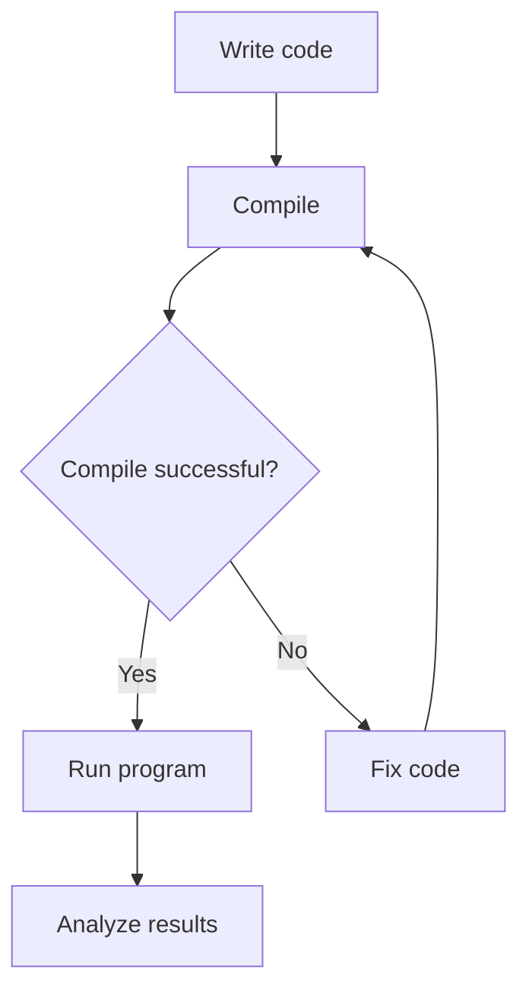
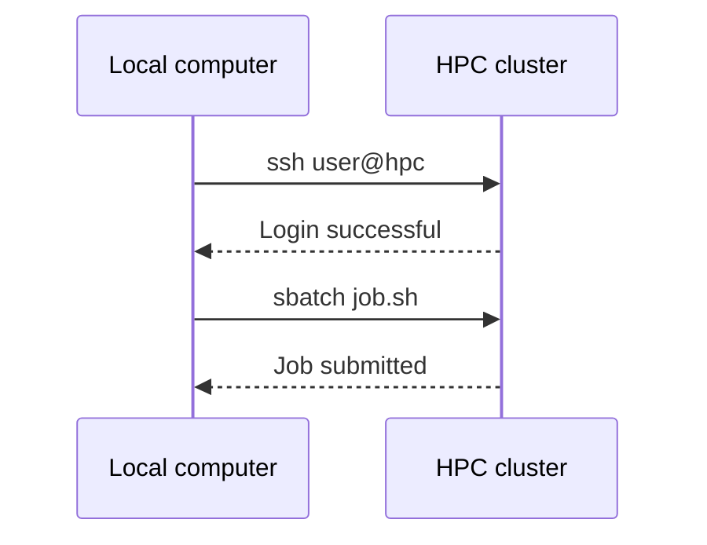

# Chapter 9: Document Writing: Markdown, Mermaid, and LaTeX

**Writing with Markdown, Mermaid, and LaTeX**

---

## Chapter Goals

After reading this chapter, you should be able to:

- Write well-structured documents, notes, and READMEs using Markdown
- Draw flowcharts in Markdown using Mermaid
- Understand the basic philosophy of LaTeX and write mathematical formulas
- Create a minimal LaTeX document and Beamer presentation
- Clearly identify when to use Markdown vs. LaTeX

---

## Motivation

Research is not just about writing code and running programs. You need to write **notes, reports, papers, homework, and presentations**. Word has clear limitations in research writing: poor formula typesetting, difficult version management, and unstable formatting.

Plain-text writing tools (Markdown and LaTeX) solve these problems: they are **plain text files** that can be version-controlled with Git, offer beautiful formula typesetting, and separate format from content.

---

## 9.1 Why Plain-Text Writing Matters in Research

| Dimension | Word / Google Docs | Markdown | LaTeX |
|-----------|-------------------|----------|-------|
| Formulas | Weak | Supported (KaTeX/MathJax) | Excellent |
| Version control | Difficult | Git-friendly | Git-friendly |
| Output format | .docx | HTML / PDF / slides | PDF |
| Learning curve | Low | Low | Medium-High |
| Best for | Everyday documents | Notes, docs, blogs | Papers, reports, presentations |

:::tip Selection Principle
- **Quick notes, team collaboration, note-taking** → Markdown
- **Formal papers, precise typesetting needed** → LaTeX
- **Don't know either?** Learn Markdown first — you can get started in 10 minutes
:::

---

## 9.2 Markdown Basic Syntax

Markdown uses simple symbols to mark text formatting. Source files are plain text (`.md`) and can be rendered to HTML, PDF, etc.

```markdown
# Heading 1
## Heading 2
### Heading 3

**Bold**  *Italic*  ~~Strikethrough~~  `inline code`

- Unordered list item
  - Nested item

1. Ordered list item
2. Ordered list item

> Blockquote

---   ← Horizontal rule
```

---

## 9.3 Tables, Code Blocks, Images, and Links

```markdown
| Method | Accuracy | Speed |
|--------|----------|-------|
| Euler | O(h) | Fast |
| RK4 | O(h⁴) | Medium |
```

Code blocks are wrapped with triple backticks, with the language specified:

````markdown
```python
import numpy as np
x = np.linspace(0, 2*np.pi, 100)
y = np.sin(x)
```
````

Images and links:

```markdown

[Link text](https://example.com)
```

---

## 9.4 Drawing Flowcharts and Diagrams with Mermaid

Mermaid is a syntax for embedding diagrams in Markdown. It is supported by GitHub, Obsidian, Docusaurus, and more.

````markdown

````

````markdown

````

:::info Mermaid's Limitations
Mermaid is suitable for drawing **schematic** diagrams, not for precise scientific plots. Use Matplotlib for data visualization and TikZ for complex academic figures.
:::

---

## 9.5 Writing Markdown in VS Code

VS Code is one of the best tools for writing Markdown, with built-in preview and excellent extension support.

### Built-in Features

VS Code natively supports Markdown:

- Syntax highlighting
- Press `Ctrl+Shift+V` (macOS: `Cmd+Shift+V`) to open preview
- Press `Ctrl+K V` (macOS: `Cmd+K V`) to open side-by-side preview (write and preview simultaneously)

### Recommended Extensions

| Extension | Extension ID | Purpose |
|-----------|-------------|---------|
| **Markdown All in One** | `yzhang.markdown-all-in-one` | Shortcuts, TOC generation, auto-completion, list formatting |
| **Markdown Preview Enhanced** | `shd101wyy.markdown-preview-enhanced` | Enhanced preview: LaTeX formulas, Mermaid, PlantUML, export to PDF/HTML |
| **markdownlint** | `davidanson.vscode-markdownlint` | Markdown format checking, keeps documents consistent |
| **Paste Image** | `mushan.vscode-paste-image` | Paste screenshots directly into Markdown with `Ctrl+Alt+V` |

Install all at once:

```bash
code --install-extension yzhang.markdown-all-in-one
code --install-extension shd101wyy.markdown-preview-enhanced
code --install-extension davidanson.vscode-markdownlint
code --install-extension mushan.vscode-paste-image
```

### Markdown All in One Shortcuts

After installation, you can use these shortcuts (macOS: replace `Ctrl` with `Cmd`):

| Shortcut | Function |
|----------|----------|
| `Ctrl+B` | Bold |
| `Ctrl+I` | Italic |
| `Ctrl+Shift+]` | Increase heading level |
| `Ctrl+Shift+[` | Decrease heading level |
| `Alt+C` | Toggle checkbox |

Other features:
- Search **"Markdown All in One: Create Table of Contents"** in the Command Palette (`Ctrl+Shift+P`) to auto-generate a table of contents
- Auto-update TOC on save
- Auto-fix ordered list numbering

### Markdown Preview Enhanced Advanced Features

This extension's preview is far more powerful than VS Code's built-in preview:

- Supports `$...$` and `$$...$$` math formula rendering
- Supports Mermaid diagram rendering
- Export to PDF, HTML, PNG
- Slide mode (reveal.js)

Search **"Markdown Preview Enhanced: Open Preview"** in the Command Palette to open the enhanced preview.

### Recommended VS Code Settings

Add to your `settings.json`:

```json
{
    "[markdown]": {
        "editor.wordWrap": "on",
        "editor.quickSuggestions": {
            "other": true,
            "comments": false,
            "strings": false
        },
        "editor.tabSize": 2
    },
    "markdown.preview.fontSize": 14
}
```

---

## 9.6 The Basic Philosophy of LaTeX

LaTeX is not a "what you see is what you get" typesetting tool — it is a **markup language**: you write content and formatting instructions in a source file, then compile it to generate a PDF.

### Minimal Document

```latex
\documentclass{article}
\usepackage[UTF8]{ctex}   % Chinese support

\title{My First LaTeX Document}
\author{Zhang San}
\date{\today}

\begin{document}
\maketitle

\section{Introduction}
This is a paragraph of plain text.

\section{Methods}
We use the fourth-order Runge-Kutta method to solve ordinary differential equations.

\end{document}
```

---

## 9.7 Installing a LaTeX Distribution

LaTeX requires a **distribution** that includes compilers and packages. Here are detailed installation instructions for all three platforms.

### macOS: MacTeX

```bash
# Option 1: Full version via Homebrew (recommended, ~4GB)
brew install --cask mactex

# Option 2: Minimal version (~100MB), install packages as needed
brew install --cask basictex
```

After installation, update your PATH:

```bash
# Reopen the terminal, or manually add the path
eval "$(/usr/libexec/path_helper)"

# Verify installation
xelatex --version
pdflatex --version
```

If you installed BasicTeX, use `tlmgr` (TeX Live Manager) to install missing packages:

```bash
sudo tlmgr update --self
sudo tlmgr install ctex    # Chinese support
sudo tlmgr install latexmk # Automatic build tool
sudo tlmgr install biber   # Bibliography tool
```

### Ubuntu / WSL: TeX Live

```bash
# Full installation (recommended, ~5GB, includes all packages)
sudo apt install texlive-full

# If disk space is limited, install incrementally
sudo apt install texlive-base           # Base (minimal)
sudo apt install texlive-latex-extra     # Common LaTeX packages
sudo apt install texlive-science         # Science packages
sudo apt install texlive-lang-chinese    # Chinese support (ctex)
sudo apt install texlive-fonts-recommended texlive-fonts-extra  # Fonts
sudo apt install latexmk                 # Automatic build tool

# Verify installation
xelatex --version
pdflatex --version
```

### Windows: MiKTeX or TeX Live

**Option 1: MiKTeX (recommended — auto-installs missing packages)**

```powershell
winget install MiKTeX.MiKTeX
```

MiKTeX's advantage is **on-demand installation**: when a missing package is detected during compilation, it prompts and automatically downloads it.

**Option 2: TeX Live**

```powershell
winget install TeXLive.TeXLive
```

Verify after installation:

```powershell
xelatex --version
pdflatex --version
```

:::tip Windows + WSL Users
If you primarily work in WSL, install `texlive-full` inside WSL (see the Ubuntu instructions) rather than on the Windows side. This way VS Code can use the Linux LaTeX compiler directly when connected via WSL.
:::

### Compilation Commands

```bash
# English documents
pdflatex my_document.tex

# Chinese documents (must use xelatex)
xelatex my_document.tex

# Use latexmk for automatic multi-pass compilation (recommended)
latexmk -xelatex my_document.tex    # Chinese
latexmk -pdf my_document.tex         # English

# Clean up temporary compilation files
latexmk -c
```

---

## 9.8 Configuring LaTeX in VS Code

VS Code + LaTeX Workshop is currently the most recommended LaTeX editing setup.

### Install the LaTeX Workshop Extension

```bash
code --install-extension James-Yu.latex-workshop
```

### Configure settings.json

Press `Ctrl+,` to open settings, click the icon in the top-right to edit `settings.json`, and add:

```json
{
    "latex-workshop.latex.autoBuild.run": "onSave",
    "latex-workshop.latex.autoClean.run": "onBuilt",

    "latex-workshop.latex.recipes": [
        {
            "name": "xelatex (Chinese documents)",
            "tools": ["xelatex"]
        },
        {
            "name": "latexmk (auto multi-pass)",
            "tools": ["latexmk"]
        },
        {
            "name": "pdflatex (English documents)",
            "tools": ["pdflatex"]
        },
        {
            "name": "xelatex → bibtex → xelatex × 2 (with bibliography)",
            "tools": ["xelatex", "bibtex", "xelatex", "xelatex"]
        }
    ],

    "latex-workshop.latex.tools": [
        {
            "name": "xelatex",
            "command": "xelatex",
            "args": [
                "-synctex=1",
                "-interaction=nonstopmode",
                "-file-line-error",
                "%DOC%"
            ]
        },
        {
            "name": "pdflatex",
            "command": "pdflatex",
            "args": [
                "-synctex=1",
                "-interaction=nonstopmode",
                "-file-line-error",
                "%DOC%"
            ]
        },
        {
            "name": "latexmk",
            "command": "latexmk",
            "args": [
                "-xelatex",
                "-synctex=1",
                "-interaction=nonstopmode",
                "-file-line-error",
                "%DOC%"
            ]
        },
        {
            "name": "bibtex",
            "command": "bibtex",
            "args": ["%DOCFILE%"]
        }
    ],

    "latex-workshop.view.pdf.viewer": "tab"
}
```

### How to Use

1. **Open a `.tex` file** — a TEX icon appears in the VS Code sidebar
2. **Auto-compile on save** (default), or press `Ctrl+Alt+B` to compile manually
3. **View PDF**: Press `Ctrl+Alt+V` to open the built-in PDF preview
4. **Forward search** (source → PDF): Press `Ctrl+Alt+J` in the `.tex` file to jump to the corresponding position in the PDF
5. **Inverse search** (PDF → source): Double-click in the PDF preview to jump to the corresponding source line

### Keyboard Shortcuts

| Shortcut | Function |
|----------|----------|
| `Ctrl+Alt+B` | Compile current document |
| `Ctrl+Alt+V` | View PDF |
| `Ctrl+Alt+J` | Forward search (source → PDF) |
| `Ctrl+Alt+C` | Clean temporary files |

### Troubleshooting Compilation Errors

1. Check the **"Problems"** panel at the bottom (`Ctrl+Shift+M`) for specific errors
2. Click the TEX icon in the sidebar → **"View LaTeX Compiler Log"** for the full compilation log
3. Common errors:
   - `File 'xxx.sty' not found`: Missing package — install it (`tlmgr install xxx` or MiKTeX auto-installs)
   - `Undefined control sequence`: Undefined command — check if you're missing a `\usepackage`
   - Chinese garbled text or errors: Make sure you're using `xelatex`, not `pdflatex`

### Verify Your Setup

Create a test file `test.tex`:

```latex
\documentclass{article}
\begin{document}
Hello, \LaTeX!

$$\int_{-\infty}^{\infty} e^{-x^2} dx = \sqrt{\pi}$$
\end{document}
```

After saving, it should auto-compile and generate `test.pdf`. Press `Ctrl+Alt+V` to view the PDF.

To test Chinese support:

```latex
\documentclass{article}
\usepackage[UTF8]{ctex}
\begin{document}
你好，\LaTeX！

Schrödinger equation: $i\hbar \frac{\partial}{\partial t} \Psi = \hat{H} \Psi$
\end{document}
```

:::caution
Chinese documents must be compiled with **xelatex**. Click the recipe name in VS Code's status bar to switch compilation recipes.
:::

---

## 9.9 Mathematical Formulas

LaTeX's most powerful feature is mathematical formula typesetting. Markdown also supports LaTeX math syntax.

```latex
% Inline formula
$E = mc^2$

% Display formula
$$\int_{-\infty}^{\infty} e^{-x^2} dx = \sqrt{\pi}$$

% Fractions, sums, integrals
$\frac{a}{b}$   $\sum_{i=1}^{N} x_i$   $\int_0^T f(t) \, dt$

% Matrix
$$\mathbf{A} = \begin{pmatrix} a_{11} & a_{12} \\ a_{21} & a_{22} \end{pmatrix}$$

% Partial differential equation
$$\frac{\partial u}{\partial t} = \alpha \nabla^2 u$$

% Schrödinger equation
$$i\hbar \frac{\partial}{\partial t} \Psi(\mathbf{r}, t) = \hat{H} \Psi(\mathbf{r}, t)$$

% Piecewise function
$$f(x) = \begin{cases} x^2 & x \geq 0 \\ -x^2 & x < 0 \end{cases}$$
```

### Symbols Commonly Used in Physics

| Syntax | Description | Syntax | Description |
|--------|-------------|--------|-------------|
| `\hbar` | Reduced Planck constant | `\nabla` | Gradient operator |
| `\partial` | Partial derivative | `\langle x \rangle` | Dirac bracket |
| `\mathbf{v}` | Vector (bold) | `\hat{H}` | Operator |
| `\vec{r}` | Vector (arrow) | `\dot{x}` | Time derivative |

---

## 9.10 Document, Report, and Homework Templates

```latex
\documentclass[12pt, a4paper]{article}
\usepackage[UTF8]{ctex}
\usepackage{amsmath, amssymb, graphicx, geometry, hyperref}
\geometry{margin=2.5cm}

\title{Computational Physics Homework 3}
\author{Zhang San \\ Student ID: 2024001}
\date{\today}

\begin{document}
\maketitle

\section{Problem Description}
Use the fourth-order Runge-Kutta method to solve the simple harmonic oscillator equation:
$$\ddot{x} + \omega^2 x = 0$$

\section{Results}
\begin{figure}[htbp]
    \centering
    \includegraphics[width=0.8\textwidth]{result.pdf}
    \caption{Comparison of numerical and analytical solutions}
    \label{fig:result}
\end{figure}

As shown in Figure \ref{fig:result}, the RK4 method achieves an accuracy of $O(h^4)$.
\end{document}
```

---

## 9.11 Beamer Presentations

```latex
\documentclass{beamer}
\usepackage[UTF8]{ctex}
\usepackage{amsmath}
\usetheme{Madrid}

\title{Application of Monte Carlo Methods to the Ising Model}
\author{Zhang San}
\institute{Department of Physics, XX University}
\date{\today}

\begin{document}

\begin{frame}
\titlepage
\end{frame}

\begin{frame}{Ising Model}
The Hamiltonian of the 2D Ising model:
$$H = -J \sum_{\langle i,j \rangle} s_i s_j - h \sum_i s_i$$
\begin{itemize}
    \item $s_i = \pm 1$: Spin variable
    \item $J$: Coupling constant
\end{itemize}
\end{frame}

\begin{frame}{Metropolis Algorithm}
\begin{enumerate}
    \item Randomly select a spin
    \item Calculate the energy change $\Delta E$ after flipping
    \item Accept the flip with probability $\min(1, e^{-\beta \Delta E})$
\end{enumerate}
\end{frame}

\end{document}
```

:::tip Beamer Themes
Commonly used themes: `Madrid`, `Berlin`, `CambridgeUS`, `Boadilla`. Switch themes with `\usetheme{ThemeName}` after `\documentclass{beamer}`.
:::

---

## 9.12 Introduction to TikZ

TikZ is a LaTeX drawing package for creating precise vector diagrams:

```latex
\usepackage{tikz}
\begin{tikzpicture}
  \draw[->] (-0.5, 0) -- (4, 0) node[right] {$x$};
  \draw[->] (0, -0.5) -- (0, 3) node[above] {$V(x)$};
  \draw[thick, blue] plot[smooth, domain=0:3.5]
    (\x, {0.5*(\x-2)*(\x-2) + 0.5});
  \node at (2, 0.3) {$x_0$};
\end{tikzpicture}
```

:::info TikZ Learning Advice
TikZ has a steep learning curve. Start by modifying existing templates and refer to [texample.net/tikz](https://texample.net/tikz/). Use TikZ for simple schematic diagrams and Matplotlib to export PDFs for complex data plots, then include them with `\includegraphics`.
:::

---

## 9.13 When to Use Markdown vs. LaTeX

| Scenario | Recommended Tool | Reason |
|----------|-----------------|--------|
| Course notes, lab logs | Markdown | Fast, Git-friendly |
| Homework, thesis | LaTeX | Formula-heavy, school provides templates |
| Academic papers | LaTeX | Journal requirements |
| Group meeting slides | Beamer or Markdown slides | Choose based on formula density |
| Project README | Markdown | GitHub standard |

Collaborative workflow: **Daily notes (Markdown) → Organize into drafts → Formal paper (LaTeX) → Presentation (Beamer)**

---

## FAQ

:::info FAQ
**Q: Recommended LaTeX editors?**
A: VS Code + LaTeX Workshop extension. Overleaf is great for online collaboration.

**Q: Chinese LaTeX compilation errors?**
A: Make sure you use `xelatex` (not `pdflatex`) and have the `ctex` package installed.

**Q: Can Markdown handle math formulas?**
A: Yes. Obsidian, Docusaurus, and GitHub (partial support) all support `$...$` and `$$...$$` syntax.

**Q: Do I need to learn all LaTeX syntax?**
A: No. Mastering document structure, formulas, figures, and references covers 90% of use cases.
:::

---

## Summary

- **Markdown** is a lightweight markup language — learn it in 5 minutes, ideal for notes and documentation
- **Mermaid** lets you embed flowcharts in Markdown
- **LaTeX** is the "industry standard" for research writing, with unmatched formula typesetting
- **Beamer** is LaTeX's presentation framework; **TikZ** is its drawing package
- Learn Markdown first, then LaTeX formulas, then templates and Beamer as needed

---

## Exercises

1. **Markdown**: Write a study note in Markdown that includes headings, lists, code blocks, and a table
2. **Mermaid**: Draw a flowchart of one of your computational workflows
3. **LaTeX formulas**: Write Maxwell's equations, the Schrödinger equation, and the Fourier transform in LaTeX
4. **LaTeX document**: Use the template to compile a PDF containing formulas and an image
5. **Beamer**: Modify the template to create a 5-slide group meeting presentation
6. **Reflection**: What tools do you currently use for notes and reports? Which of them could be migrated to Markdown or LaTeX?
